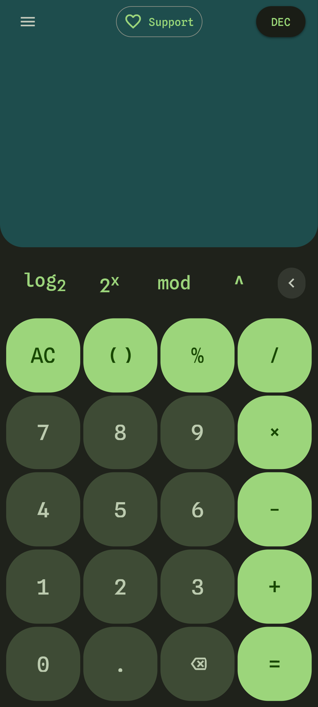
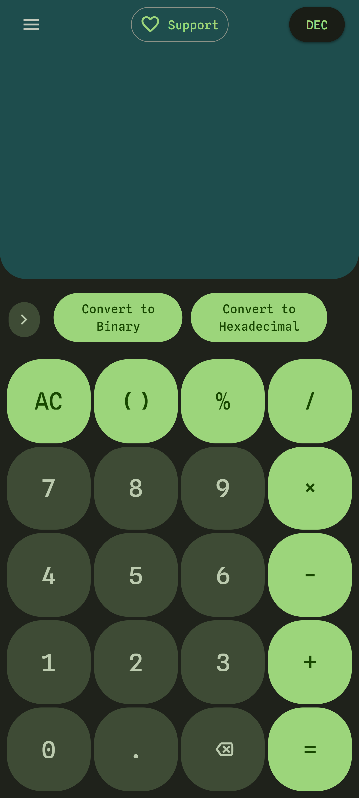

## ByteCalc: Calculator for Programmers

ByteCalc is a light-weight calculator on your browser. It has functions like log base two, power of two and modulus, aimed specifically towards computer science students.

Being a PWA, ByteCalc can be easily installed to your device's homescreen.

## Setup

This project uses TypeScript and SCSS without any frameworks. All setup are done via running different commands defined in `npm scripts` in `package.json`.

## Screenshots

